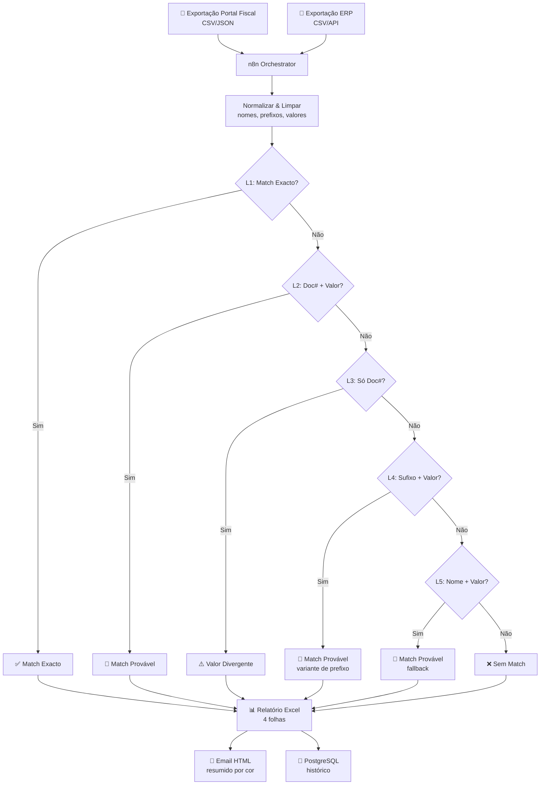
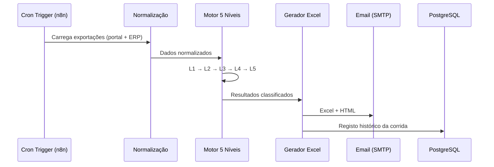

# Arquitectura — n8n Reconciliation Engine

> Estado real em 2026-05-25 · Commit de referência: main

## Em uma imagem

## Regra que organiza tudo

**Níveis de confiança decrescente, paragem no primeiro match.**
Cada nível afrouxa um critério de matching. O resultado de cada fatura é o nível mais alto (mais rigoroso) onde houve correspondência.

## Um ciclo do início ao fim

## Decisões que não são negociáveis

1. **Matching em JavaScript nativo** — sem servidor Python externo; tudo corre dentro do n8n
2. **5 níveis sempre correm por ordem** — nunca saltar níveis, mesmo que L1 já resolva maioria
3. **Output sempre Excel + Email** — os dois em simultâneo; nunca só um
4. **Normalização antes do matching** — maiúsculas, sem acentos, sem prefixos/sufixos legais
5. **Histórico sempre gravado** — mesmo em corridas de teste
