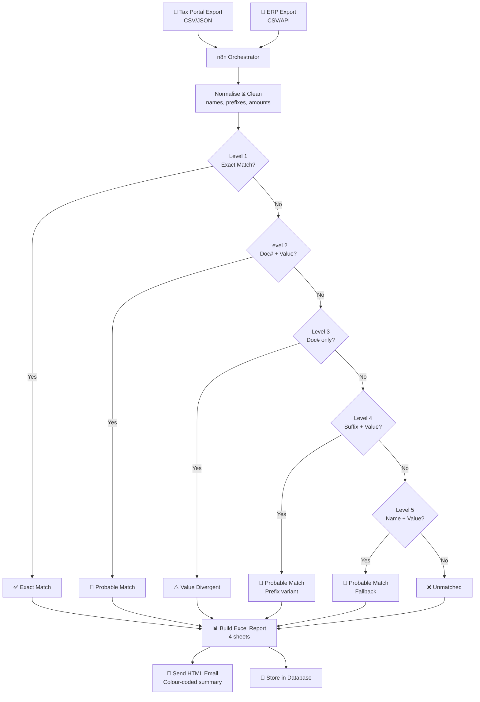

# n8n Reconciliation Engine

> A 5-level intelligent matching engine built in n8n that reconciles invoices between government tax systems and ERP platforms — automatically, every month.


---

## The Problem

Every month, finance teams manually compare hundreds of invoices between two sources:
- **Government tax portal** (e.g. e-Fatura / AT in Portugal)
- **ERP system** (e.g. Dynamics 365, SAP, or similar)

The two never match perfectly. Supplier names differ. Document prefixes vary. Values have small discrepancies. Someone spends days finding the gaps.

## The Solution

A 5-level matching algorithm that classifies every invoice automatically:

| Status | Meaning |
|--------|---------|
| ✅ **Exact Match** | Perfect match on all fields |
| 🔶 **Probable Match** | High confidence, minor variance |
| ⚠️ **Value Divergent** | Same document, different amount |
| ❌ **Missing in ERP** | In tax portal, not in ERP |
| 🔵 **Missing in Tax Portal** | In ERP, not in tax portal |
| 🚫 **Cancelled** | Cancelled at source |

Output: an Excel report with 4 sheets + a colour-coded HTML email summary.

**A multi-day manual process becomes a scheduled workflow that runs itself.**

---

## Architecture



---

## 5-Level Matching Logic

### Level 1 — Exact Match
```
document_number == document_number
AND normalize(supplier_name) == normalize(supplier_name)
AND abs(amount - amount) < 0.01
```

### Level 2 — Document + Value (name tolerance)
```
document_number == document_number
AND abs(amount - amount) < 0.01
```

### Level 3 — Document Number Only
```
document_number == document_number
→ flags as Value Divergent for manual review
```

### Level 4 — Suffix + Value (prefix variation)
```
strip_prefix(document_number) == strip_prefix(document_number)
AND abs(amount - amount) < 0.01
# Handles: FAC-001 vs FAT-001 vs 001
```

### Level 5 — Name + Value (last resort)
```
normalize(supplier_name) == normalize(supplier_name)
AND abs(amount - amount) < 0.01
```

---

## Stack

| Component | Tool |
|-----------|------|
| Workflow orchestration | [n8n](https://n8n.io) |
| Matching logic | JavaScript (n8n Code node) |
| Data processing | Python scripts |
| Storage | PostgreSQL / Supabase |
| Report generation | Excel (xlsx) |
| Notifications | Email (HTML) |

---

## Setup

### Prerequisites
- n8n instance
- PostgreSQL or Supabase database
- SMTP email credentials
- Source data exports (CSV or API access)

### 1. Configure environment

```bash
git clone https://github.com/RobsonAdvincula/n8n-reconciliation-engine.git
cd n8n-reconciliation-engine
cp .env.example .env
```

### 2. Set up database

```bash
psql -U postgres -d your_db -f scripts/schema.sql
```

### 3. Import workflow

1. Open n8n → **Workflows → Import**
2. Upload `workflow/reconciliation-engine.json`
3. Connect credentials

### 4. Schedule

Set the trigger to run monthly (or on demand via webhook).

---

## Example Results

From a real production run (company and data anonymised):

```
Total tax portal records:   607
Total ERP records:          703

✅ Exact matches:           149  (24.5%)
🔶 Probable matches:        325  (53.5%)
⚠️  Value divergent:          3   (0.5%)
❌ Missing in ERP:           124  (20.4%)
🔵 Missing in tax portal:    230  (32.7%)
🚫 Cancelled:                  6   (1.0%)
```

> Note: percentages exceed 100% as some records appear in both missing categories across the two datasets.

---

## Output Files

```
output/
├── reconciliation_report.xlsx   # 4-sheet Excel report
│   ├── Summary                  # High-level totals
│   ├── Matched                  # All confirmed matches
│   ├── Review Required          # Probable + divergent
│   └── Unmatched                # Missing from either side
└── email_summary.html           # Colour-coded email preview
```

---

## Normalisation Rules

To maximise match rates, supplier names and document numbers are normalised before comparison:

- Strip leading/trailing whitespace
- Uppercase all strings
- Remove common suffixes: `LDA`, `SA`, `UNIPESSOAL`, `LTD`, `S.A.`
- Strip document prefixes: `FAC`, `FAT`, `FT`, `RC`, `FR`
- Replace accented characters: `ã→a`, `é→e`, `ç→c`

---

## License

MIT — free to use, adapt, and build on.

---

*Built by [Robson Advincula](https://linkedin.com/in/robsonadvincula) — AI & Automation Consultant*
